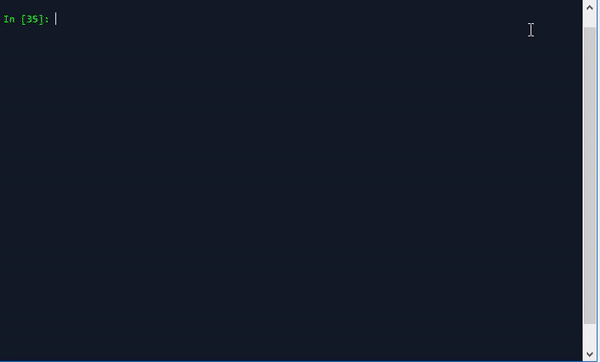
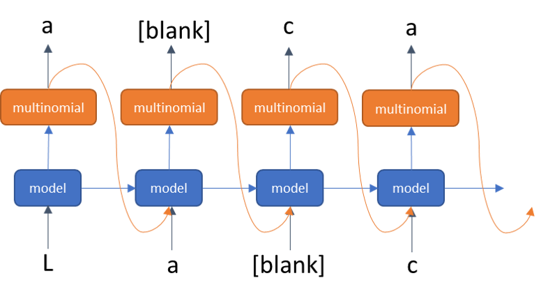

# AI Spanish Poet



---

> La poesía artificial de la vida,
>
> y el río de la esperanza me apaga
>
> y se consume el tiempo de la muerte.
>
> Todo es el deseo de la piel de la tierra.
>
> La misma esperanza de las almas
>
> con la boca de su mano hermosa.
>
> Esta noche puede amarte la noche.
>
> y el corazón aprendió la pena de la mente.
>
> El corazón de la vida es su vientre.
>
> AI.S.P

---

_Note: above love poem was written by an Artificial Intelligence algorithm_

## Deep learning model to generate Spanish love poems

This a mini-project developed for a my Spanish BBL

The idea is to train a deep learning model to write Spanish love poems
First, the model will be trained with thousands of famous Spanish poems
Then, the model will be tuned to write love theme poems trough transfer
learning technique with a small dataset containing only love poems

## How the AI poet was trained?

The model is a character-based, that means it will be train to infer the next character
of a sequence knowing the last n characters of the sentence.

```
input = 'hello worl' -> output = 'd'
```

This is a very complicated task as the model will have to learn not only the art of
poetry but also the meaning of a sequence of words and the Spanish grammar from scratch.

The project is organized as the below structure

- ./data/
  - DB/ : _raw data_
  - data_processed/ : _clean corpus to train model_
- ./src/
  - build_data_poems.py _data cleansing and formatting from raw text to tensor shape_
  - training.py _first stage model trained of general poems_
  - transfer_learning.py _model tuned on love poems_
  - write_poem.py _main script to generate poems based on model trained_
  - utils.py _common function used in train and inference scripts_
- ./models/ : _placeholder to save model network and its weights_

The **AI Spanish Poet** project can be reproduced running the following scripts

**1. Build Data**

`python build_data_poems.py`

`python build_data_love.py`

A pickle file will be generated for each dataset (general poems and love poems)
with is respective corpus, train and test data sequences.

**2. Train generic poem model**

`python training.py`

Using general poems sequences, multiple **LSTM** layers are trained

**3. Learning/Style transfer**

`python transfer_learning.py`

**LSTM** network is finetune with the love poems corpus

**4. Generate new poem**

`python write_poems.py`

Run the AI model to wirte a new poem based on a short sentence given by the user

## Data

As any artificial intelligence algorithm, the data is the fuel to feed the model.

I could not find any dataset with spanish poems available in the web as compared to
the famous Shakespare dataset available in english. Therefore a webscraping was performed
in order to create the spanish dataset.

Fortunately, a total of **13,218** poems were found (after running a the `web_scraping_poems.py` algorithm in only one website) of which **80** are specifically classified as "romantic poems"

Poems includes authors such as: Pablo Neruda, Mario Benedetti, Gabriela Mistral,
Rubén Darío, Francisco de Quevedo, among other **1,300 more poets**

The `build_data_poems.py` script applies basic NLP text cleansing, removing docs
too small or big and keeping only most popular characters.
After cleansing the summary of the corpus is:

- 45 unique characters `¡!(),-.:;¿?abcdefghijklmnopqrstuvwxyzáéíñóú`
- 4,917,888 total characters
- 55,358 unique words

* Most popular words:

| word    | count |
| ------- | ----- |
| como    | 5,760 |
| para    | 4,043 |
| cuando  | 2,371 |
| amor    | 2,281 |
| sobre   | 2,188 |
| noche   | 2,076 |
| ojos    | 1,999 |
| tiempo  | 1,530 |
| porque  | 1,405 |
| corazón | 2,371 |
| siempre | 1,241 |
| cuerpo  | 1,155 |
| muerte  | 1,143 |
| tierra  | 1,132 |

_At least 4 or 5 digits_

### Tensor data

Corpus is divided into small sentences (sequences) of text to be fed into the model

**Input/Output data**



**Example of how sequences are built**


Final data to use as training have 53,239 short sequences

`Train data shape - X: (53239, 120) - Y: (53239, 100)`

## Training with general theme

One of the most difficult problems in data science filed is the time dependent events.
Sales forecasting, stock markets' prediction or speech recognition are just few examples
of this type of problems.

A text generator algorithm can be seen as a stream of characters lined up one
after another, where the challenge is to predict the next character. this is a difficult
challenge to solve as just one wrong prediction will make the entire text meaningless.

In recent breakthroughs in deep learning field, Long-Short Term Memory networks (LSTMs)
are the cutting-edge type of architecture used for almost any time sequence type of problem

Therefore a LSTM have been deployed on the **AI spanish Poet** algorithm.
A snapshot of the model can be found below


## Transfer Learning with love poems

After first training with the generic Spanish poems data set. Last 2 layers of the model were re-trained with the love data set to fine tune predictions into a romantic theme


## Generating poems

The model will use a short sentence as seed, or nothing, to start writing the poem.

It will predict the next character based on sequence of letters seen so far.

To make the model more creative next character prediction is based on a categorical probability distributions of all characters instead of taking the digit with the highest probability.

Level of creativity could be adjust with the `creativity` param.

Prediction is done in a loop until it reaches the 'end of poem' character ($)

```python
# predict next character
def predict_next_char(sequence, n_to_char, char_to_n, model, max_seq=128, creativity=3):
    '''
    sequence: input sequence seen so far. (if blank model will start with a random character)
    n_to_char, char_to_n: Vocabulary dictionaries used in training
    model: trained model weights
    max_seq: maximum number of characters to seen in one sequence (use the same sequence as model)
    creativity: 1: super creative, 10: Conservative.
    '''
    # start with a random character
    if len(sequence)==0:
        sequence = '\n'
    # cut sequence into max length allowed
    sequence = sequence[max(0, len(sequence)-max_seq):].lower()
    # transform sentence to numeric
    sequence_encoded = np.array([char_to_n[char] for char in sequence])
    # reshape for single batch predicton
    sequence_encoded = np.reshape(sequence_encoded, (1, len(sequence_encoded)))
    # model prediction
    pred_encoded = model.predict(sequence_encoded)
    # last prediction in sequence
    pred = pred_encoded[0][-1]
    # from log probabilities to normalized probabilities
    pred_prob = np.exp(pred)
    pred_prob = np.exp(pred)/(np.sum(np.exp(pred))*1.0001)
    # get index of character  based on probabilities
    # add an extra digit (issue from np.random.multinomial)
    pred_char = np.random.multinomial(creativity, np.append(pred_prob, .0))
    # character with highest aperances
    chars_max = pred_char==pred_char.max()
    # get index of those characters
    chars_max_idx = [i for i in range(len(pred_char)) if chars_max[i]]
    char_idx = np.random.choice(chars_max_idx, 1)[0]
    # if prediction do not match vocabulary. do nothing
    if char_idx > len(n_to_char)-1:
        char_idx = ''
    else:
        # to character
        char = n_to_char[char_idx]
    return char
```
